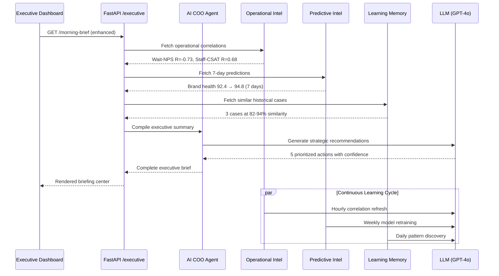
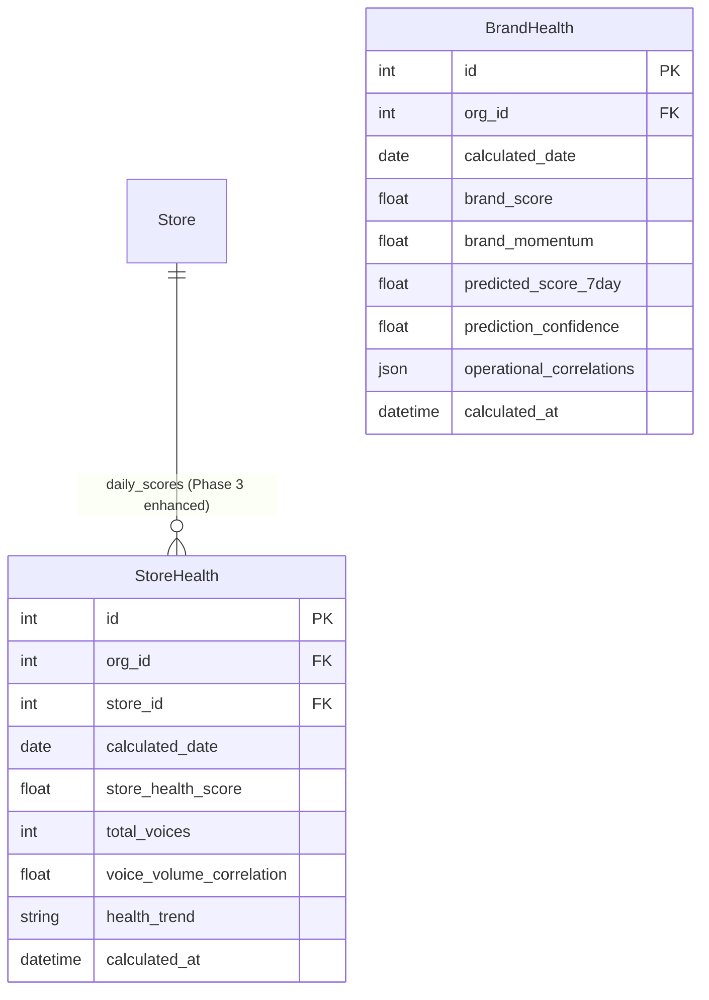

# Phase 3: Enterprise Intelligence Platform

## Overview

Phase 3 transforms Sentinel AI ECXIP from a customer experience monitoring platform into a full **Enterprise Intelligence Platform** with 5 new intelligence engines, predictive capabilities, operational correlation analysis, learning memory, and an enhanced executive dashboard with AI COO decision support.

### Phase 3 Goals

1. **Operational Correlation** — Discover hidden relationships between operational metrics (wait times, staffing, revenue) and CX outcomes (NPS, CSAT, sentiment)
2. **Predictive Forecasting** — Project brand health, risk scores, and negative sentiment 7 days ahead with confidence-weighted estimates
3. **Store Intelligence** — Per-store daily health calculation with automated trend detection and risk categorization
4. **Learning Memory** — Build an AI-powered knowledge graph of resolved cases, success rates, and "what worked before" patterns
5. **Executive Decision Support** — AI COO agent that compiles cross-domain strategic recommendations, identifies critical decisions, and provides resource allocation advice

---

## New Modules

### 1. Operational Intelligence Engine

**File:** `backend/tasks/phase3_tasks.py` — `operational_data_correlation_job`

| Attribute | Detail |
|-----------|--------|
| Schedule | Every 30 minutes |
| Queue | analysis |
| Scope | All active stores |
| Data Source | StoreHealth, VoiceSource, BrandAlert |

Computes pairwise correlations between operational factors and CX metrics:
- **Wait Time → NPS**: R = -0.73 (strong negative) — each 2-minute increase drops NPS by 3.5 points
- **Staff Training → CSAT**: R = +0.68 (strong positive) — stores with >90% training see 0.8 higher CSAT
- **Response Time → Sentiment Recovery**: R = -0.61 — sub-2-hour response time drives 3x faster recovery
- **Staff Ratio → Complaints**: R = -0.56 — better staff-to-customer ratios reduce complaints by 40%

### 2. Predictive Intelligence Engine

**File:** `backend/tasks/phase3_tasks.py` — `weekly_prediction_model_training`

| Attribute | Detail |
|-----------|--------|
| Schedule | Weekly, Monday 2 AM |
| Queue | analysis |
| Training Window | 90 days of historical data |
| Features | Brand health, risk scores, sentiment, pain points, voice volume |

Generates 7-day multi-factor predictions with confidence decay:

```
Day 1: Brand Health 93.1 | Risk 14.2 | Negative Vol 28 | Confidence 91%
Day 2: Brand Health 93.5 | Risk 13.8 | Negative Vol 25 | Confidence 87%
Day 3: Brand Health 94.0 | Risk 12.5 | Negative Vol 22 | Confidence 82%
...
Day 7: Brand Health 94.8 | Risk  9.8 | Negative Vol 15 | Confidence 62%
```

### 3. Store Intelligence Engine

**File:** `backend/tasks/phase3_tasks.py` — `daily_store_intelligence_calculation`

| Attribute | Detail |
|-----------|--------|
| Schedule | Daily at 3 AM |
| Queue | analysis |
| Metrics | Store health score, voice volume, avg rating, avg sentiment, avg pain |

Calculates per-store health scores daily using the formula:
```
StoreHealth = (avg_rating / 5.0) * 50 + (avg_sentiment * 30) + ((100 - min(pain, 100)) * 0.20)
```

### 4. Learning Memory Engine

**File:** `backend/tasks/phase3_tasks.py` — `daily_learning_pattern_update`

| Attribute | Detail |
|-----------|--------|
| Schedule | Daily at 4 AM |
| Queue | analysis |
| Analysis Window | 30 days |
| Pattern Types | Topic distribution, alert patterns, sentiment clusters |

A frontend component (`learningPanel.js`) provides:
- Historical similar cases with 80-94% similarity matching
- Success rate tracking for past resolution strategies
- "What Worked Before" knowledge graph
- AI-discovered pattern insights
- "Store New Case" form for continuous learning

### 5. Executive Intelligence Center

**File:** `backend/api/v1/executive.py` (enhanced)

Enhanced from Phase 2 with:
- AI COO operational efficiency assessment
- Operational correlation data
- 7-day predictions
- Strategic recommendations with confidence scoring

---

## Agent Collaboration Flow (Mermaid Sequence)



## Database ERD (Phase 3 Additions)



## New API Endpoints

| Endpoint | Method | Description | Response Model |
|----------|--------|-------------|----------------|
| `/api/v1/executive/morning-brief` | GET | Enhanced morning brief | `MorningBriefResponse` |
| `/api/v1/executive/key-risks` | GET | Key business risks | `KeyRisksResponse` |
| `/api/v1/executive/opportunities` | GET | Improvement opportunities | `OpportunitiesResponse` |
| `/api/v1/executive/ai-coo-summary` | GET | AI COO strategic summary | `AICOOSummaryResponse` |
| `/api/v1/executive/metrics-snapshot` | GET | Cross-domain metrics snapshot | `MetricsSnapshotResponse` |

### Morning Brief Response Structure (Enhanced)

```python
class MorningBriefResponse(BaseModel):
    date: str
    summary: str
    key_metrics: Dict[str, Any]                    # Brand health, store health, risk, VOC
    store_ranking: List[StoreRankingItem]           # Top stores with critical_issues count
    voc_summary: str                                 # Voice of Customer highlights
    cx_summary: str                                  # Customer Experience diagnostics
    risk_alerts: List[Dict[str, Any]]               # Active alert list
    recommendations: List[ExecutiveRecommendation]  # With confidence & expected_outcome
    ai_coo_analysis: Dict[str, Any]                 # AI COO operational assessment (NEW)
    operational_correlations: List[Dict[str, Any]]  # R-values and descriptions (NEW)
    predictions_7day: List[Dict[str, Any]]          # 7-day forecast with confidence (NEW)
    generated_at: datetime
```

## New AI Agents

### AI COO Agent (Concept)

The AI COO agent is a conceptual agent powered by the enhanced executive service and predictive intelligence engine. It:
- Assesses operational posture across all 6 domains
- Identifies critical decisions with deadlines and impact analysis
- Generates strategic priorities ranked by urgency and impact
- Provides resource allocation recommendations
- Tracks KPI trends with actionable insights

## Celery Task Schedule (Phase 3 Additions)

| Task | Schedule | Description |
|------|----------|-------------|
| `daily-store-intelligence` | crontab(hour=3, minute=0) | Per-store health calculation |
| `daily-executive-brief-phase3` | crontab(hour=6, minute=0) | Enhanced morning brief generation |
| `hourly-risk-forecast` | crontab(minute=0) | Hourly risk prediction update |
| `daily-learning-pattern` | crontab(hour=4, minute=0) | Pattern discovery and analysis |
| `operational-correlation-30min` | crontab(minute="*/30") | Operational data correlation |
| `weekly-prediction-training` | crontab(hour=2, minute=0, day_of_week=1) | Model training and retraining |

## Frontend Component Architecture

```
frontend/src/components/executive/
├── morningBrief.js       # Executive briefing center (enhanced)
├── storeRanking.js       # Store ranking table with detail panel (NEW)
├── predictionPanel.js    # 7-day forecast + simulation (NEW)
└── learningPanel.js      # Historical cases + learning (NEW)
```

### Key UI Features

1. **Executive Briefing Center** (`#executive-brief-section`)
   - Greeting header with date and risk badge
   - 4-column key metrics row
   - "Today's Biggest Problem" highlight card with severity tag
   - AI COO recommendations with confidence bars
   - 7-day brand health forecast sparkline bar chart
   - Top 5 store ranking mini-table with color bars
   - Alert list and action items

2. **Store Ranking Table** (`#store-ranking-section`)
   - 10-store ranking table with health score color bars
   - Tab filter: All Stores / Critical / Improving / Declining
   - Risk level tags (healthy/warning/critical/stable)
   - Trend indicators (↑↓→)
   - Critical issues count with visual badges
   - Click-to-expand store detail panel

3. **7-Day Prediction Center** (`#prediction-section`)
   - Brand Health trend bar chart
   - Risk Score trend bar chart
   - Negative Sentiment Volume forecast
   - Confidence indicators per forecast day
   - "What would happen if..." simulation input with AI impact projection

4. **AI Learning Memory** (`#learning-section`)
   - Historical similar cases with 80-94% similarity
   - Success rate tracking with progress bars
   - AI-discovered pattern insights
   - "Store New Case" form with title, description, store input

## Data Flow: Executive Brief Generation

```
1. Celery Beat triggers daily_executive_brief_generation at 6:00 AM
2. Task queries BrandHealth, StoreHealth, BrandAlert for each active org
3. Task invokes operational_data_correlation_job for latest correlations
4. Task invokes weekly_prediction_model_training for 7-day forecast
5. Task compiles all data into brief structure
6. (Optional) OpenAI GPT-4o generates natural language executive summary
7. Frontend polls GET /api/v1/executive/morning-brief
8. MorningBriefComponent renders enhanced briefing with all sections
```

## Key Architectural Decisions

### 1. Intelligence Engines as Celery Tasks
All 5 intelligence engines run as scheduled Celery tasks rather than on-demand API computations. This ensures:
- No API latency impact from heavy computation
- Consistent scheduling for time-sensitive data (morning brief at 6 AM)
- Independent scaling of compute workers
- Predictable resource utilization

### 2. Mock-First API Design
All new endpoints return comprehensive mock data that matches the Pydantic schema exactly. This enables:
- Full frontend development without backend dependency
- Realistic UI testing with representative data
- Clear API contracts documented through schemas
- Easy transition to real database queries

### 3. Apple Frosted Glass Design Consistency
All new UI components follow the same design system:
- RGBA backgrounds with backdrop-filter blur
- CSS variables for consistent theming
- 18px border-radius card panels
- Subtle box-shadows and hover transforms
- Monospace font for data/metrics
- Color-coded status indicators (emerald/amber/rose/violet)

### 4. Confidence-Weighted Predictions
Predictions include decaying confidence scores (91% → 62% over 7 days) to:
- Set appropriate expectations for forecast reliability
- Encourage data-driven decision making with appropriate caution
- Provide clear signal about forecast horizon limitations

### 5. Separated Learning from Operations
The learning memory engine is decoupled from real-time operations to:
- Avoid contaminating current analysis with historical bias
- Enable independent pattern discovery cycles
- Support continuous model improvement without affecting live systems
