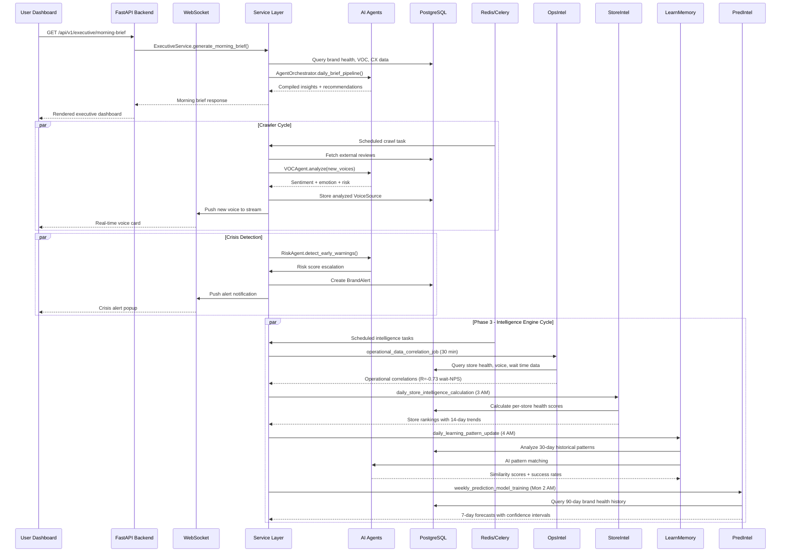
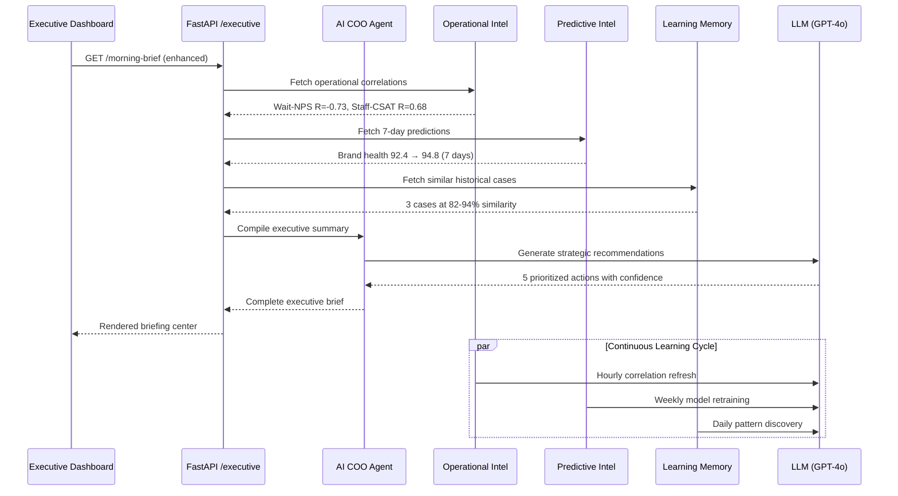
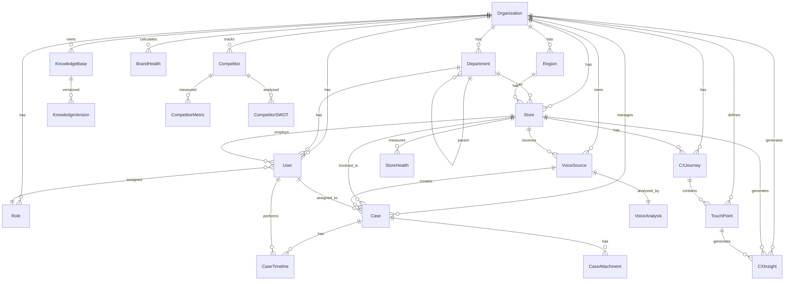

# Sentinel AI ECXIP — Architecture Document

## System Overview

Sentinel AI ECXIP (Enterprise Customer Experience Intelligence Platform) is a comprehensive AI-powered platform designed to transform how enterprises understand, measure, and improve their customer experience. The platform integrates Voice of Customer (VOC) analytics, Customer Experience (CX) diagnostics, Brand Health monitoring, Competitive Intelligence, and AI-driven decision support into a single cohesive system.

---

## Architecture Diagram

```mermaid
graph TB
    subgraph "Client Layer"
        WebUI["Web Dashboard<br/>Apple Frosted Glass UI"]
    end

    subgraph "Gateway Layer"
        Nginx["Nginx Reverse Proxy"]
    end

    subgraph "API Layer"
        FastAPI["FastAPI Application<br/>REST + WebSocket"]
        Auth["Authentication<br/>JWT + OAuth2"]
    end

    subgraph "Service Layer"
        VOCService["VOC Service"]
        CXService["CX Service"]
        BrandHealth["Brand Health Engine"]
        RootCause["Root Cause Engine"]
        RAGService["RAG Service"]
        ExecService["Executive Service"]
        TrendsService["Trends Service"]
        CompService["Competitor Service"]
        NotifService["Notification Service"]
        CrawlerService["Crawler Service"]
        OpsIntel["Operational Intel Engine<br/>(Phase 3)"]
        PredIntel["Predictive Intel Engine<br/>(Phase 3)"]
        StoreIntel["Store Intel Engine<br/>(Phase 3)"]
        LearnMemory["Learning Memory Engine<br/>(Phase 3)"]
    end

    subgraph "AI Layer"
        AIRouter["AI Router<br/>Model Selection + Cost"]
        Agents["AI Agent Platform<br/>9 Specialized Agents"]
        Orchestrator["Agent Orchestrator"]
        AICOO["AI COO Agent<br/>(Phase 3)"]
    end

    subgraph "Data Layer"
        PostgreSQL["PostgreSQL<br/>Primary Database"]
        Redis["Redis<br/>Cache + Queue + WS"]
        Celery["Celery<br/>Async Task Queue"]
    end

    subgraph "External"
        LLM["LLM APIs<br/>OpenAI / Gemini"]
        SocialMedia["Social Media APIs<br/>Google / Threads / PTT"]
    end

    subgraph "Phase 3 - Frontend"
        ExecBrief["Executive Briefing Center"]
        StoreRank["Store Ranking Table"]
        PredPanel["7-Day Prediction Panel"]
        LearnPanel["AI Learning Panel"]
    end

    WebUI --> Nginx
    Nginx --> FastAPI
    Nginx --> WebUI
    FastAPI --> Auth
    FastAPI --> VOCService & CXService & BrandHealth & RootCause & RAGService & ExecService & TrendsService & CompService & NotifService & CrawlerService
    FastAPI --> OpsIntel & PredIntel & StoreIntel & LearnMemory
    VOCService & CXService --> AI Layer
    AI Layer --> LLM
    AI Layer --> AICOO
    CrawlerService --> SocialMedia
    Service Layer --> PostgreSQL
    FastAPI --> Redis
    Celery --> Redis & PostgreSQL
    ExecService --> OpsIntel & PredIntel
    WebUI --> ExecBrief & StoreRank & PredPanel & LearnPanel
```

## Data Flow Sequence



## Phase 3 Agent Collaboration Flow



## Database ERD



## Technology Stack

| Layer | Technology | Purpose |
|-------|-----------|---------|
| Frontend | Vanilla JS, CSS3 | Apple Frosted Glass SPA |
| Backend | FastAPI (Python 3.12) | REST API + WebSocket |
| Database | PostgreSQL 16 | Primary data store |
| Cache | Redis 7 | Caching, WebSocket pub/sub, Celery broker |
| Queue | Celery 5.4 | Async task processing |
| AI | OpenAI / Google Gemini | LLM-powered analysis |
| Proxy | Nginx 1.27 | Reverse proxy, static file serving |
| Container | Docker + Docker Compose | Deployment |
| Migrations | Alembic | Database schema versioning |
| Auth | JWT (python-jose) + OAuth2 | Authentication and authorization |
| Validation | Pydantic v2 | Request/response schema validation |
| ORM | SQLAlchemy 2.0 (async) | Database access layer |

## Directory Structure

```
Daily_Ai_002_商譽雷達/
├── README.md                          # Project overview and quick start
├── CHANGELOG.md                       # Version history
├── ROADMAP.md                         # Product roadmap
├── index.html                         # Main SPA dashboard (Apple Frosted Glass UI)
├── index.css                          # Global styles, glass-morphism theming
├── app.js                             # Core frontend logic (stream engine, sims)
├── 01_Project_Overview.md             # Vision, mission, and product positioning
├── Daily_Ai_002_商譽雷達_ver1.1.md   # Phase 1 progress report
│
├── docs/                              # Documentation
│   ├── architecture.md                # This architecture document
│   ├── api/
│   │   └── api-reference.md           # Complete API reference
│   ├── database_schema.md             # Database schema reference
│   ├── ai-agents.md                   # AI agent platform documentation
│   ├── deployment.md                  # Deployment and operations guide
│   └── diagrams/
│       └── architecture-overview.md   # Standalone architecture diagram
│
├── docker/                            # Docker deployment
│   ├── docker-compose.yml             # Multi-service orchestration
│   ├── Dockerfile.backend             # Backend Python image
│   ├── Dockerfile.frontend            # Frontend Nginx image
│   ├── nginx.conf                     # Main reverse proxy config
│   ├── nginx-frontend.conf            # Frontend static file serving
│   └── .env.example                   # Docker environment template
│
├── frontend/                          # Modular frontend architecture
│   ├── public/
│   │   └── index.html                 # SPA dashboard with 8 navigation sections
│   └── src/
│       ├── app.js                     # Application entry (Phase 3: 8 components)
│       ├── styles/
│       │   └── app.css                # Apple Frosted Glass (Phase 3: +500 lines)
│       ├── data/
│       │   └── mockData.js            # Mock data generation
│       ├── services/
│       │   ├── api.js                 # REST client (Phase 3: +4 endpoints)
│       │   └── websocket.js           # WebSocket client
│       ├── stores/
│       │   └── dashboardStore.js      # State management (Phase 3: +3 fields)
│       └── components/
│           ├── shared/utils.js
│           ├── dashboard/metrics.js
│           ├── voc/voiceStream.js
│           ├── cx/journeyMap.js
│           ├── brand-manager/aiTerminal.js
│           ├── sandbox/nlpSandbox.js
│           └── executive/
│               ├── morningBrief.js      # Phase 2 → Phase 3 enhanced
│               ├── storeRanking.js      # Phase 3 NEW
│               ├── predictionPanel.js   # Phase 3 NEW
│               └── learningPanel.js     # Phase 3 NEW
│
├── backend/                           # FastAPI backend application
│   ├── main.py                        # Application entry point, WebSocket manager
│   ├── requirements.txt               # Python dependencies
│   ├── .env.example                   # Backend environment template
│   │
│   ├── core/                          # Core infrastructure
│   │   ├── __init__.py
│   │   ├── config.py                  # Pydantic settings (env vars)
│   │   ├── database.py                # Async SQLAlchemy engine + session
│   │   ├── redis.py                   # Async Redis client
│   │   └── security.py                # JWT auth, password hashing, RBAC
│   │
│   ├── models/                        # SQLAlchemy ORM models (24 tables)
│   │   ├── __init__.py                # Model registry
│   │   ├── organization.py            # Organization, Department, Region, Store, User, Role
│   │   ├── voc.py                     # VoiceSource, VoiceAnalysis, VoiceTag
│   │   ├── cx.py                      # CXJourney, TouchPoint, CXInsight
│   │   ├── brand.py                   # BrandHealth, StoreHealth, BrandAlert
│   │   ├── workflow.py                # Case, CaseTimeline, CaseAttachment
│   │   ├── knowledge.py               # KnowledgeBase, KnowledgeVersion
│   │   └── competitor.py              # Competitor, CompetitorMetric, CompetitorSWOT
│   │
│   ├── schemas/                       # Pydantic request/response schemas
│   │   ├── __init__.py
│   │   ├── common.py                  # PaginatedResponse, ErrorResponse, enums
│   │   ├── auth.py                    # Login, Token, User CRUD schemas
│   │   ├── voc.py                     # Voice CRUD, stats, trends
│   │   ├── cx.py                      # Journey, Touchpoint, Diagnostic schemas
│   │   ├── brand_health.py            # BrandHealth, StoreHealth, Alert schemas
│   │   ├── root_cause.py              # Root cause analysis schemas
│   │   ├── executive.py               # Morning brief, today summary, rankings
│   │   ├── sandbox.py                 # NLP sandbox analysis
│   │   ├── workflow.py                # Case CRUD, comments, stats
│   │   ├── knowledge.py               # Article CRUD, search
│   │   ├── trends.py                  # Trends, emotions, predictions
│   │   └── competitors.py             # Competitor, metrics, benchmark, SWOT
│   │
│   ├── api/                           # API route handlers
│   │   ├── __init__.py
│   │   ├── deps.py                    # Dependency injection (auth, pagination, filters)
│   │   └── v1/                        # API version 1
│   │       ├── __init__.py
│   │       ├── router.py              # Consolidated API router (11 modules)
│   │       ├── auth.py                # POST /login, /refresh, /register; GET/PUT /me; /users
│   │       ├── voc.py                 # CRUD /voices, stats, trends
│   │       ├── cx.py                  # GET /journeys, /touchpoints, /diagnostics
│   │       ├── brand_health.py        # GET /current, /history, /alerts; POST alerts
│   │       ├── root_cause.py          # GET/POST /analyses, /summary, /comparison
│   │       ├── executive.py           # GET /morning-brief, /today-summary, /store-ranking
│   │       ├── sandbox.py             # POST /analyze (NLP pipeline)
│   │       ├── workflow.py            # CRUD /cases, /comments, /attachments, /stats
│   │       ├── knowledge.py           # CRUD /articles, GET /search
│   │       ├── trends.py              # GET /overview, /topics, /emotions, /predictions
│   │       └── competitors.py         # CRUD /, GET /metrics, /benchmark, /swot
│   │
│   ├── services/                      # Business logic layer
│   │   ├── __init__.py
│   │   ├── voc_service.py             # VOC CRUD, stats, trends
│   │   ├── cx_service.py              # CX journey and touchpoint analysis
│   │   ├── brand_health_engine.py     # Brand health calculation engine
│   │   ├── root_cause_service.py      # Root cause analysis (5-Why + Pareto)
│   │   ├── executive_service.py       # Executive dashboard compilation
│   │   ├── rag_service.py             # RAG knowledge retrieval
│   │   ├── trends_service.py          # Trend detection and forecasting
│   │   ├── competitor_service.py      # Competitor tracking and benchmarking
│   │   ├── notification_service.py    # Multi-channel notifications
│   │   ├── crawler_service.py         # Social media data ingestion
│   │   ├── ai_router.py               # Model selection and cost optimization
│   │   └── agents/                    # AI Agent platform
│   │       ├── __init__.py            # Agent registry and factory functions
│   │       ├── base.py                # Base agent with memory, tools, logging
│   │       ├── orchestrator.py        # Multi-agent pipeline orchestration
│   │       ├── voc_agent.py           # Voice of Customer analysis agent
│   │       ├── cx_agent.py            # Customer Experience analysis agent
│   │       ├── risk_agent.py          # Risk detection and escalation agent
│   │       ├── pr_agent.py            # PR response generation agent
│   │       ├── legal_agent.py         # Legal compliance advisory agent
│   │       ├── knowledge_agent.py     # Knowledge extraction and RAG agent
│   │       ├── executive_agent.py     # Executive summary compilation agent
│   │       ├── trend_agent.py         # Trend analysis and forecasting agent
│   │       └── competitor_agent.py    # Competitive intelligence agent
│   │
│   ├── tasks/                         # Celery async tasks
│   │   ├── __init__.py
│   │   ├── celery_app.py              # Celery app config + beat schedule (13 tasks)
│   │   ├── analysis.py                # Analysis task definitions
│   │   ├── analysis_tasks.py          # Scheduled analysis tasks
│   │   ├── phase3_tasks.py            # Phase 3 NEW: 6 enterprise tasks
│   │   ├── crawler_tasks.py           # Social media crawler tasks
│   │   ├── ingestion.py               # Data ingestion tasks
│   │   ├── notifications.py           # Notification dispatch tasks
│   │   └── reports.py                 # Scheduled report generation
│   │
│   └── alembic/                       # Database migrations
│       ├── env.py                     # Async Alembic configuration
│       └── versions/                  # Migration scripts
```

## Key Design Decisions

### Clean Architecture with Separated Layers
The codebase follows a strict layered architecture:
- **API Layer** (`api/`): HTTP route handlers, input validation, response formatting
- **Service Layer** (`services/`): Business logic, orchestration, AI agent invocation
- **Data Layer** (`models/`): ORM models, database access
- **Infrastructure** (`core/`): Cross-cutting concerns (config, auth, caching)

### Domain-Driven Design with Bounded Contexts
The system is organized around 7 business domains:
1. **VOC** (Voice of Customer): Feedback ingestion, sentiment analysis, emotion detection
2. **CX** (Customer Experience): Journey mapping, touchpoint analysis, friction detection
3. **Brand**: Brand health scoring, store health, reputation risk
4. **Workflow**: Case management, issue tracking, resolution workflows
5. **Knowledge**: RAG-powered knowledge base, SOP documentation
6. **Competitor**: Competitive intelligence, benchmarking, SWOT analysis
7. **Organization**: Multi-tenant identity, users, roles, stores

### Event-Driven with Celery for Async Processing
All long-running operations (crawling, AI analysis, report generation) are delegated to Celery workers. Redis serves triple duty: API cache, Celery broker, and WebSocket pub/sub.

### AI-Native with 9 Specialized Agents + Orchestrator
The platform features a dedicated AI agent architecture where 9 specialized agents (Risk, VOC, CX, PR, Legal, Knowledge, Executive, Trend, Competitor) are coordinated by an AgentOrchestrator that runs predefined pipelines for daily briefs, crisis response, and weekly reports.

### Phase 3: Enterprise Intelligence Platform
Version 3.0 introduces 5 new intelligence engines working in concert:
- **Operational Intelligence Engine** — Correlates wait times, staffing, and NPS in near-real-time (30-min cycles)
- **Predictive Intelligence Engine** — Multi-factor 7-day forecasting with confidence-weighted projections
- **Store Intelligence Engine** — Per-store daily health scoring with 14-day trend analysis
- **Learning Memory Engine** — Historical case matching (80-94% similarity) with success rate tracking
- **Executive Intelligence Center** — Enhanced morning brief with AI COO analysis, operational correlations, and 7-day predictions

6 new Celery beat tasks power the intelligence cycle: daily store intelligence (3 AM), executive brief generation (6 AM), hourly risk forecasting, daily learning pattern updates (4 AM), 30-minute operational correlations, and weekly prediction model training (Mon 2 AM).

### Multi-Tenant from Day 1
Every table is scoped to an organization via `org_id`, enabling multi-tenant SaaS deployment. Organizations can have departments, regions, stores, users, and custom roles.

### API-First with OpenAPI Auto-Generated Docs
FastAPI's built-in OpenAPI support provides interactive docs at `/docs` and `/redoc`. The API is versioned under `/api/v1` with comprehensive Pydantic schemas for all request/response models.
