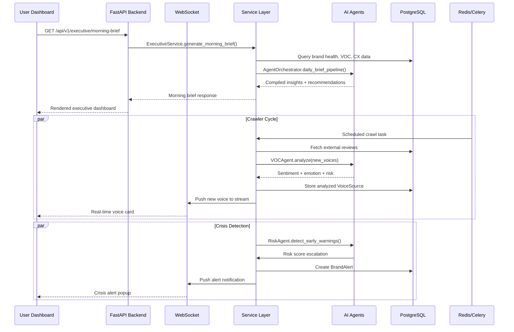
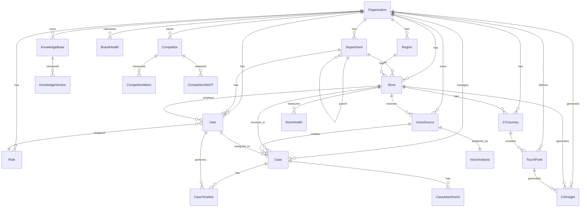

# Sentinel AI ECXIP — Architecture Overview Diagram

```mermaid
graph TB
    subgraph "Client Layer"
        WebUI["Web Dashboard<br/>Apple Frosted Glass UI"]
    end

    subgraph "Gateway Layer"
        Nginx["Nginx Reverse Proxy"]
    end

    subgraph "API Layer"
        FastAPI["FastAPI Application<br/>REST + WebSocket"]
        Auth["Authentication<br/>JWT + OAuth2"]
    end

    subgraph "Service Layer"
        VOCService["VOC Service"]
        CXService["CX Service"]
        BrandHealth["Brand Health Engine"]
        RootCause["Root Cause Engine"]
        RAGService["RAG Service"]
        ExecService["Executive Service"]
        TrendsService["Trends Service"]
        CompService["Competitor Service"]
        NotifService["Notification Service"]
        CrawlerService["Crawler Service"]
    end

    subgraph "AI Layer"
        AIRouter["AI Router<br/>Model Selection + Cost"]
        Agents["AI Agent Platform<br/>9 Specialized Agents"]
        Orchestrator["Agent Orchestrator"]
    end

    subgraph "Data Layer"
        PostgreSQL["PostgreSQL<br/>Primary Database"]
        Redis["Redis<br/>Cache + Queue + WS"]
        Celery["Celery<br/>Async Task Queue"]
    end

    subgraph "External"
        LLM["LLM APIs<br/>OpenAI / Gemini"]
        SocialMedia["Social Media APIs<br/>Google / Threads / PTT"]
    end

    WebUI --> Nginx
    Nginx --> FastAPI
    Nginx --> WebUI
    FastAPI --> Auth
    FastAPI --> VOCService & CXService & BrandHealth & RootCause & RAGService & ExecService & TrendsService & CompService & NotifService & CrawlerService
    VOCService & CXService --> AI Layer
    AI Layer --> LLM
    CrawlerService --> SocialMedia
    Service Layer --> PostgreSQL
    FastAPI --> Redis
    Celery --> Redis & PostgreSQL
```

## Data Flow Sequence



## Database ERD


