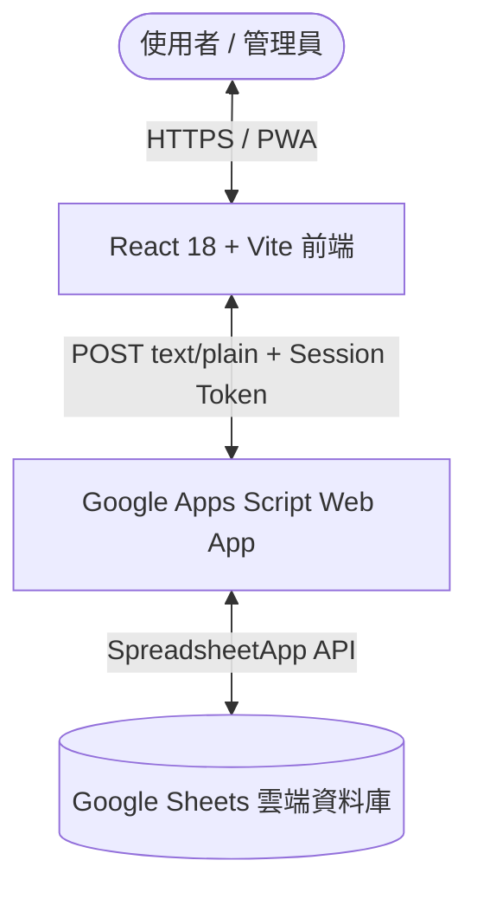

# 貨櫃出租營運管理系統 (Container Rental Operational Management System v1)

本專案為一套針對貨櫃出租業務設計的全方位營運管理系統。採用 **React + Vite** 作為前端介面，並以 **Google Apps Script (GAS) Web App** 搭配 **Google Sheets** 作為雲端無伺服器 (Serverless) 後端與資料庫儲存。

---

## 📌 系統簡介與架構

本系統完全移除傳統獨立 HTTP 伺服器與 Firebase/Firestore 依賴，大幅降低維運代價與平台訂閱成本。所有資料操作均透過加密與鑑權後之 POST 請求與 Google Apps Script Web App 通訊，資料儲存於 Google Drive 上的 Google Sheets 試算表中。



### 🛠️ 技術棧 (Tech Stack)

| 層級 | 技術 / 套件 | 說明 |
| --- | --- | --- |
| **前端 (Frontend)** | React 18, TypeScript, Vite | 高效 UI 渲染與模組化開發 |
| **樣式 (Styling)** | Tailwind CSS, Lucide React | 響應式設計 (RWD) 與高品質 UI 圖示集 |
| **PWA & 離線** | Vite PWA Plugin | 支援桌面與行動裝置 PWA 安裝與快取 |
| **測試框架** | Vitest | 單元測試與邏輯驗證 |
| **後端 (Backend)** | Google Apps Script (GAS) | 託管於 Google 雲端之 Web App 路由與服務層 |
| **資料儲存 (Database)** | Google Sheets (試算表) | 6 個專屬 Worksheets 作為結構化資料庫 |
| **驗證機制 (Auth)** | SHA-256 + Salt, Session Token | 後端密碼雜湊比對與 Token 簽章驗證 (儲存於 `sessionStorage`) |

---

## 📁 專案目錄結構

```text
Daily_Ai_004_Futain0857 system/
├── CLAUDE.md                           # AI 開發規範與系統指引
├── PROJECT_SUMMARY.md                  # 本專案完整總覽與架構文件
│
├── apps-script/                        # Google Apps Script 後端程式碼
│   ├── appsscript.json                 # GAS 專案資訊清單設定
│   ├── .clasp.json                     # clasp 工具設定檔
│   ├── Code.gs                         # Web App 入口點 (doPost)
│   ├── Router.gs                       # API 路由轉發與 Request 處理
│   ├── Auth.gs                         # 身份驗證與 Session Token 管理
│   ├── Validation.gs                   # 輸入資料格式校驗模組
│   ├── SheetRepository.gs              # Google Sheets CRUD 存取抽象層
│   ├── ContainersService.gs            # 貨櫃業務邏輯層
│   ├── CustomersService.gs             # 客戶業務邏輯層
│   ├── RentalsService.gs               # 租約與結算業務邏輯層
│   ├── LedgersService.gs               # 帳務與支出業務邏輯層
│   ├── DashboardService.gs             # 儀表板數據統計與預警邏輯
│   ├── Setup.gs                        # 資料庫結構初始化腳本
│   ├── Utils.gs                        # 通用公用函式 (如 SHA-256、格式化)
│   ├── ManualTests.gs                  # 後端邏輯測試腳本
│   └── README.md                       # Apps Script 部署詳細步驟
│
├── container-rental-app-v1/            # React/Vite 前端主應用程式
│   ├── src/
│   │   ├── pages/                      # 系統各大頁面模組
│   │   │   ├── DashboardPage.tsx       # 營運儀表板
│   │   │   ├── CustomersPage.tsx       # 客戶資料管理
│   │   │   ├── ContainersPage.tsx      # 貨櫃資產管理
│   │   │   ├── RentalsPage.tsx         # 租金與合約管理
│   │   │   ├── CustomerLedgersPage.tsx # 客戶帳務對帳 (應收/實收/押金)
│   │   │   ├── ManagementLedgersPage.tsx# 營運支出管理
│   │   │   ├── SettingsPage.tsx        # 系統設定與維護
│   │   │   └── LoginPage.tsx           # 管理員登入頁面
│   │   ├── services/api/               # API 通訊與抽象層 (gasClient.ts)
│   │   ├── contexts/                   # 全局狀態 (SessionContext.tsx)
│   │   ├── components/                 # 共用 UI 組件
│   │   ├── hooks/                      # 自訂 Custom Hooks
│   │   └── types/                      # TypeScript 型別定義
│   │
│   ├── project_management/             # 專案文檔與規格書
│   │   ├── API_SPEC.md                 # 完整 API 介面規格說明
│   │   ├── ARCHITECTURE.md             # 系統架構設計書
│   │   ├── AUTH_PLAN.md                # 認證機制與 Session 設計
│   │   ├── DATABASE_SCHEMA.md          # 試算表資料庫欄位綱要說明
│   │   ├── DEPLOYMENT.md               # 系統線上部署指引
│   │   ├── CHANGELOG.md                # 專案變更履歷記錄
│   │   ├── TEST_REPORT.md              # 測試報告
│   │   └── PHASE_2_MIGRATION_PLAN.md   # GAS 遷移計畫紀錄
│   │
│   ├── package.json                    # 前端相依套件與指令設定
│   ├── vite.config.ts                  # Vite 建置設定
│   └── README.md                       # 前端開發說明
│
└── system/                             # 系統開發兩階段任務規劃
    └── 貨櫃出租App_V1_兩階段開發任務_Antigravity執行版.md
```

---

## 📊 核心業務模組功能說明

1. 📈 **營運儀表板 (Dashboard)**
   - 數據概覽：即時統計目前**總貨櫃數**、**已出租數**、**出租率 (%)**、**本月總營收**與**預期應收租金**。
   - 營運預警：自動偵測並高亮顯示**即將到期（30天內）**與**已逾期**之租約。
   - 最新動態：整合 `audit_logs` 提供系統近期操作軌跡。

2. 👥 **客戶管理 (Customers)**
   - 客戶建檔：紀錄客戶名稱、統一編號 / 身分證字號、聯絡電話、地址與備註。
   - 歷史紀錄：可查詢特定客戶之歷史租用合約、開立帳單與繳費紀錄。

3. 📦 **貨櫃資產管理 (Containers)**
   - 資產追蹤：維護貨櫃編號、尺寸規格 (20呎/40呎/高櫃等)、目前狀態 (`空閒`/`已出租`/`維修中`)、放置地點。
   - 租金底價：設定月租金底價標準，方便簽約時比對。

4. 📜 **租約與合約管理 (Rentals)**
   - 合約簽訂：連結指定客戶與空閒貨櫃，設定起迄日期、約定月租金與押金金額。
   - 退租結算：合約到期或提前退租結算，自動計算應退/應扣押金與結算金額。
   - 自動發單：依據合約條款自動或手動觸發產生每月客戶帳務 (Customer Ledger)。

5. 💵 **客戶帳務管理 (Customer Ledgers)**
   - 帳務類型：支援 `應收租金`、`實收租金`、`押金收取`、`押金退還` 與 `押金抵扣`。
   - 對帳狀態：追蹤每筆帳務未繳、部分繳納與已結清狀態。

6. 💸 **營運支出管理 (Management Ledgers)**
   - 成本控管：紀錄場地租金、水電費、貨櫃維修費、運輸拖運費與雜項支出。
   - 分類統計：協助營運團隊掌握月度與年度營運成本結構。

7. ⚙️ **系統維護與稽核 (Settings & Audit Logs)**
   - 安全性：提供管理者變更密碼功能，支援 Session 連線狀態檢查。
   - 稽核日誌：紀錄新增、變更、刪除等關鍵操作者與時間戳記。

---

## 🗄️ Google Sheets 資料庫 Schema 概要

Google Sheets 試算表中建立以下 6 個工作表 (Worksheets)：

| 工作表名稱 (Sheet Name) | 主要功能 | 關鍵欄位 (Primary / Key Fields) |
| --- | --- | --- |
| `customers` | 客戶主資料 | `customer_id`, `name`, `tax_id`, `phone`, `address`, `created_at` |
| `containers` | 貨櫃主資料 | `container_id`, `code`, `size`, `status`, `location`, `min_monthly_price` |
| `rental_records` | 租約紀錄 | `rental_id`, `customer_id`, `container_id`, `start_date`, `end_date`, `monthly_rent`, `deposit`, `status` |
| `customer_ledgers` | 客戶應收與實收流水 | `ledger_id`, `rental_id`, `customer_id`, `type`, `amount`, `payment_date`, `status` |
| `management_ledgers` | 營運支出流水 | `ledger_id`, `category`, `amount`, `transaction_date`, `description`, `created_at` |
| `audit_logs` | 系統操作稽核紀錄 | `log_id`, `operator`, `action`, `details`, `timestamp` |

---

## 🚀 開發與部署操作指引

### 1. 後端部署 (Google Apps Script)
1. 在 Google Drive 建立新試算表並取得 `SPREADSHEET_ID`。
2. 將 `apps-script/` 內的所有 `.gs` 及 `appsscript.json` 複製至 Apps Script 專案。
3. 在專案設定的「指令碼屬性 (Script Properties)」中設定：
   - `SPREADSHEET_ID`
   - `ADMIN_USERNAME`
   - `PASSWORD_SALT`
   - `PASSWORD_HASH`
   - `SESSION_SECRET`
4. 執行 `Setup.gs` 中的 `setupSpreadsheet()` 初始化工作表結構與欄位標頭。
5. 部署為 Web 應用程式 (Web App)，存取權限設為 **「任何人 (Anyone)」**，取得網址。

### 2. 前端開發 (React / Vite)
1. 進入 `container-rental-app-v1` 目錄：
   ```bash
   cd container-rental-app-v1
   ```
2. 設定環境變數 (`.env.local`)：
   ```env
   VITE_GAS_WEB_APP_URL=https://script.google.com/macros/s/YOUR_DEPLOYMENT_ID/exec
   ```
3. 常用指令：
   ```bash
   npm ci          # 安裝相依套件
   npm run dev     # 啟動本機開發伺服器
   npm run test    # 執行單元與邏輯測試 (Vitest)
   npm run lint    # ESLint 程式碼檢查
   npm run build   # 編譯與打包前置作業 (產出至 dist 目錄)
   ```
