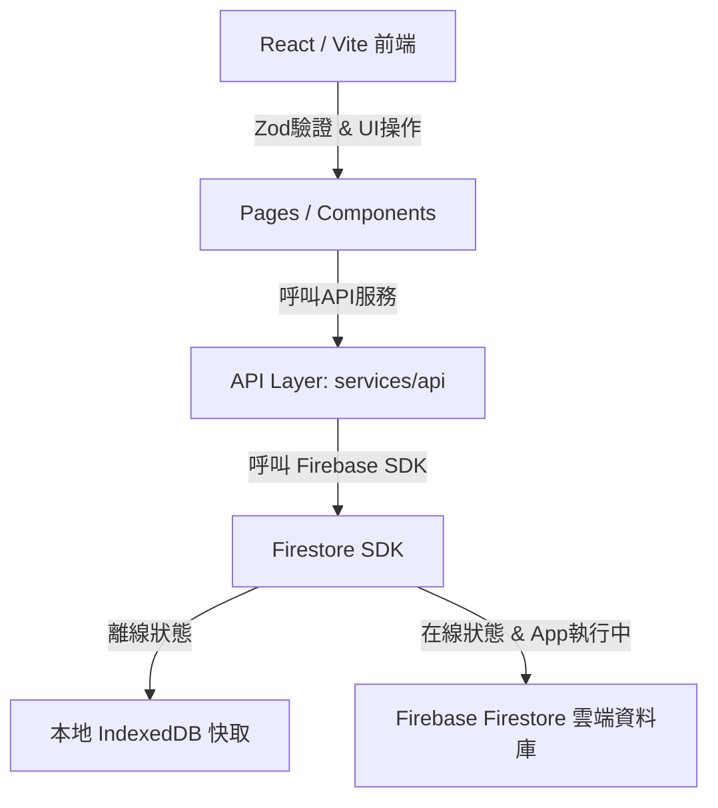

# 貨櫃出租 App V1 - 系統架構說明書 (Architecture) - Firebase Firestore 版

本專案採用 **Firebase Firestore 雲端資料庫 + 原生離線快取架構**，前端與資料庫直連，並具備優異的離線操作與自動同步功能。

---

## 1. 系統技術棧 (Technology Stack)

- **前端核心框架**：React 18 + Vite 5 + TypeScript + Tailwind CSS v3
- **本地離線快取與雲端資料庫**：Firebase Firestore SDK (原生支援 IndexedDB 離線持久化與同步)
- **API 與同步邏輯**：直連 Firestore，利用 SDK 的中繼資料監聽實現即時連線與同步狀態回饋。
- **身分驗證 (規劃中)**：Firebase Auth (Email/Password, Google 登入)。

---

## 2. 離線與同步機制 (Offline Sync Workflow)

系統的強健性在於其由 Firebase 提供的 **原生離線快取持久化**。

### 2.1 資料寫入流程 (Create/Update/Delete)

當使用者在前端新增資料或登記收付款時：
1. **Firestore 離線寫入**：所有寫入操作會第一時間進入本地 IndexedDB 快取。
2. 前端 UI 會透過快取數據立即更新（無延遲感）。
3. **雲端同步時間點**：當網路重新連線，且 **App/SDK 處於執行狀態下**，Firestore SDK 會在背景自動將變更同步上傳至雲端。這與「背景毫秒級同步保證」不同，若 App 已關閉，同步將暫停，直到下一次 App 啟動且網路在線時才會繼續。

### 2.2 多筆原子寫入與交易控制 (Atomicity vs Transaction)

1. **批次寫入 (Batched Writes)**：
   - 用於確保多筆寫入的原子性 (Atomicity)。意即：這一組寫入動作要麼全部成功，要麼全部失敗。
   - **請注意：Batched Writes 不等於數據庫交易 (Transaction)**。它不具備「在寫入前先讀取並判斷」的併發控制能力。
2. **交易控制 (Transactions - `runTransaction`)**：
   - 當寫入邏輯涉及「讀取後判斷」之防呆校驗（例如：必須先讀取貨櫃狀態，確認 status 為 `available` 且沒有其他生效中的租賃後，才允許建立合約並將貨櫃狀態改為 `rented`），API 層必須改用 `runTransaction` 進行鎖定控制。
   - 在交易中，若有其他並行操作修改了該筆數據，交易將自動重試，從而防範並發衝突。

---

## 3. API 抽象化層 (Service Abstraction)

所有與 Firebase Firestore 的讀寫皆被封裝在 `src/services/api` 的獨立模組中。
- 當未來需要從 Firebase 升級至正式的 PostgreSQL 關係型資料庫時，前端 UI 程式碼無需做任何改動，僅需改寫 API 層與數據庫連線 client 即可，將遷移風險降至最低。
# 現行架構說明（2026-07-14）

本系統採 React/Vite 前端直接連線 Firebase Auth 與 Firestore；不存在獨立 Backend API。`src/services/api` 為 Firestore 資料存取抽象層。Google Apps Script 相關描述已過時，不屬於現行架構。Firebase 設定由建置階段 `VITE_FIREBASE_*` 注入，資料授權由 Firestore Rules 執行。
