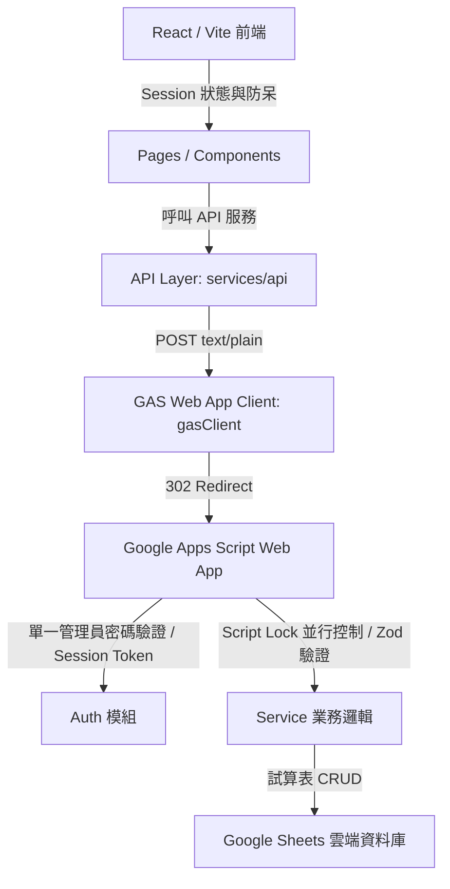

# 貨櫃出租 App V1 - 系統架構說明書 (Architecture)

本專案採用 **React/Vite 前端 + Google Apps Script Web App 後端 + Google Sheets 雲端資料庫** 的輕量級無伺服器架構。

---

## 1. 系統技術棧 (Technology Stack)



- **前端核心框架**：React 18 + Vite 5 + TypeScript + Tailwind CSS v3 + PWA 外殼。
- **後端 API 服務**：Google Apps Script (GAS) Web App。所有請求皆為 POST 到單一 Web App `/exec` 入口。
- **資料儲存庫**：Google Drive 中的 Google Sheets 試算表，包含 6 大核心資料表分頁。
- **身分驗證與會期**：單一管理員憑證驗證，簽發具時效性（預設 24 小時）的 HMAC-SHA256 簽名 Session Token。

---

## 2. 後端業務邏輯與並行控制

### 2.1 請求與回應格式
所有 API 請求統一發送至 GAS Web App，格式如下：
* **Content-Type**: `text/plain;charset=utf-8` (規避瀏覽器非同源複雜 Preflight 檢查)
* **請求 Body**:
  ```json
  {
    "action": "actionName",
    "sessionToken": "jwt.like.token",
    "payload": { ... }
  }
  ```
* **統一回應**:
  ```json
  {
    "ok": true,
    "data": { ... },
    "error": null
  }
  ```

### 2.2 並行與交易控制 (Concurrency Control)
由於 Google Sheets 不是真正的交易式資料庫，本系統利用 Google Apps Script 的 **`LockService`** 進行寫入並行控制：
1. 當建立租約、退租或更新關鍵狀態時，後端會使用 `LockService.getScriptLock()` 來申請獨佔鎖（最高等待 10 秒）。
2. 在鎖保護區間內，後端會完整讀取 current 資料並做嚴格的防呆驗證（例如確認貨櫃是否仍為 `available`，客戶是否存在，以及是否有其他生效中的合約）。
3. 驗證無誤後，將多張 Sheet 進行集中寫入，最後在 `finally` 區塊釋放鎖，確保資料原子性（Atomicity）與一致性。

---

## 3. 離線策略 (Offline Strategy)

本系統本階段採 **線上優先 (Online-First)** 策略：
- **PWA 靜態快取**：應用程式外殼（App Shell）及靜態資源（CSS、JS、SVG 等）已設定 Service Worker 離線快取，使用者斷網時仍可載入 App 介面。
- **離線唯讀**：在離線狀態下，使用者可檢視最後一次讀取的快取營運資料，但系統會顯示黃色「離線狀態」警告，且會自動將「新增」、「編輯」、「登記收款」、「退租」等修改功能按鈕停用（Disabled），以防止使用者進行離線修改而造成 Google Sheets 發生寫入衝突或遺失。
