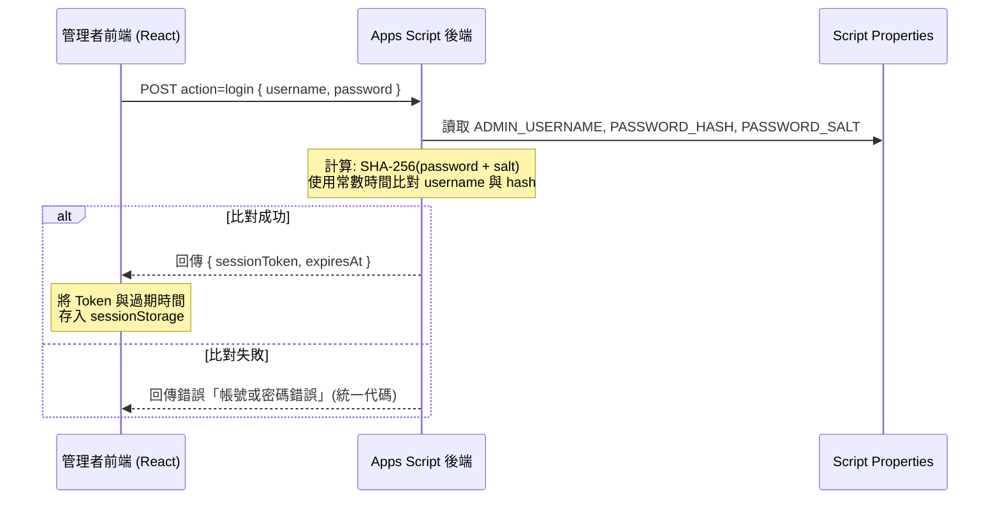

# 單一管理者驗證規劃說明書 (Auth Plan)

本專案採用後端 Google Apps Script 雜湊比對與 Token 簽章機制，以維護單一管理員登入會期安全。

---

## 1. 登入比對與會期設計



### 1.1 常數時間比對 (Safe Compare)
為防止時序攻擊（Timing Attack），後端在核對使用者名稱與密碼雜湊時，採用常數時間比對演算法。不論輸入在第幾個字元不符，比對所花費的時間皆相同，避免攻擊者藉由探測回應時間推算正確字元。

### 1.2 登入失敗鎖定機制 (Lockout)
後端利用 CacheService 進行登入失敗計數：
- 當某個帳號連續登入失敗達上限（預設為 5 次）時，系統將凍結該帳號登入 5 分鐘。
- 凍結期間內，後端直接拒絕該帳號的登入嘗試，防範暴力破解（Brute Force）。

---

## 2. Session Token 簽章規格

登入成功後簽發的 `sessionToken` 採用類似 JWT 的無狀態簽名格式：

```text
sessionToken = payloadBase64 + "." + signatureBase64
```

1. **Payload**:
   ```json
   {
     "username": "admin",
     "expiresAt": 1715800000000,
     "salt": "0.123456789"
   }
   ```
   將此 JSON 以 `Base64WebSafe` 編碼作為 `payloadBase64`。
2. **Signature**:
   使用後端保管的 `SESSION_SECRET`，對 `payloadBase64` 進行 `HMAC-SHA256` 簽章加密，並將結果以 `Base64WebSafe` 編碼作為 `signatureBase64`。
3. **驗證**:
   每次前端呼叫需要登入權限的 API 時，必須在 POST JSON Body 中夾帶 `sessionToken`。後端會重新計算簽章比對，並驗證 `expiresAt` 是否已逾期。

---

## 3. 前端會期管理

- **儲存位置**：`sessionToken` 及 `expiresAt` 統一保存在瀏覽器的 **`sessionStorage`** 中。當使用者關閉瀏覽器分頁或視窗時，會期資料將會自動被瀏覽器清除。
- **過期重導向**：如果呼叫 GAS API 時後端回傳 `UNAUTHORIZED` 錯誤，前端 `gasClient` 將會自動清除 `sessionStorage` 內的憑證，發送過期事件並重定向回登入頁面。
- **登出動作**：點選登出時，前端會通知後端將 Token 寫入暫時黑名單並清除本地 `sessionStorage`。

---

## 4. 權限與 RBAC 限制說明

> [!IMPORTANT]
> **系統權限限制提示**：本系統目前為單一管理員模式 (Single Admin System)，所有受保護的操作皆基於單一管理員會期驗證。**目前尚未支援多角色權限控制與 RBAC (Role-Based Access Control) 矩陣**。前端與後端在全域範圍內實施一致性 Lock 與 HMAC Session 驗證。
