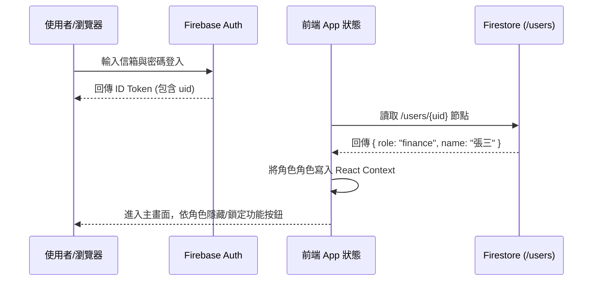

# Firebase Authentication 身分驗證與權限規劃書 (AUTH_PLAN.md)

本文件提供貨櫃出租系統於 Phase 2 引進 **Firebase Authentication** 的實作規劃，包括使用者登入驗證、角色欄位定義與安全性配置要點。

---

## 1. 驗證方式與流程 (Authentication Methods)

系統將支援以下兩種主要的登入方式：

### 1.1 電子郵件與密碼登入 (Email / Password)
- **主功能**：提供場地管理人員、財務專員及系統管理員以註冊好的公司信箱與密碼進行登入。
- **特點**：
  - 易於整合。
  - 後台可直接建立並停用使用者帳號。
  - 密碼強度設定：要求至少 8 字元，包含英文與數字。

### 1.2 谷歌單一登入 (Google Login - 選用)
- **主功能**：支援使用公司配置的 Google Workspace 帳號一鍵登入。
- **特點**：
  - 提升登入便利性。
  - 可於 Firebase Console 設定限制僅允許特定網域的信箱（例如 `@company.com`）登入系統，防止外部人員進入。

---

## 2. 使用者角色與資料庫對照 (User Schema & Firestore Integration)

當使用者通過 Firebase Auth 成功登入後，系統將讀取其 Firebase Auth UID，並於 Firestore 中的 `/users` 集合檢索其對應的權限角色。



### 2.1 `/users` 集合文件結構 (Firestore User Doc Schema)
```json
{
  "email": "finance@company.com",
  "name": "陳小美",
  "role": "finance",
  "created_at": "2026-07-07 14:00:00",
  "updated_at": "2026-07-07 14:00:00"
}
```
*註：`role` 欄位的值必須限制為 `admin`、`finance`、`staff`、`viewer` 之一。*

---

## 3. 金鑰與憑證安全性警示 (Credential Security Warning)

> [!CAUTION]
> **開發期動態設定與生產期靜態環境變數之安全邊界**
>
> 1. **LocalStorage 動態金鑰警示**：
>    - 目前 V1 版本中在「系統設定 (Settings)」中提供輸入 Firebase Config 憑證並儲存於 `localStorage` 的功能。
>    - **此功能僅限 Demo 展示、開發調試與無伺服器直接部署測試使用**。
>    - 它不應保留在正式上線的版本中，因為如果惡意代碼或惡意瀏覽器擴充套件讀取了 localStorage，您的 Firebase 連線金鑰可能會外洩，且不便於集中控管。
>
> 2. **正式生產版最佳實踐**：
>    - 正式生產版本**必須停用 Settings 頁面中的金鑰修改表單**。
>    - 所有的 Firebase 金鑰必須直接綁定在建置階段的 `.env` 環境變數中，或在部署時由 CI/CD pipeline（如 Vercel environment variables）注入。
>    - 程式碼僅直接讀取 `import.meta.env.VITE_FIREBASE_...`，不對外曝露任何修改配置的 UI 入口。

---

## 4. 登入介面 UI/UX 實作建議 (Phase 2 UI Suggestions)
- **全域守衛 (Global Router Guard)**：
  - 於 `src/App.tsx` 中使用 `onAuthStateChanged()` 監聽登入狀態。
  - 若未登入，強制定向至 `/login` 頁面，Layout 與其餘業務頁面一律不予加載。
- **按鈕權限防呆 (Disable Unallowed Actions)**：
  - 在前端 UI 中，依據使用者的 `role` 來顯示/隱藏或禁用特定按鈕。例如：若角色為 `staff`，則「合約管理」頁面的「建立租約」按鈕應為 disabled，並在滑鼠懸停時顯示「無此操作權限」。
# Auth 現況（2026-07-14）

Firebase Email/Password Auth 已實作，非規劃中功能。登入後讀取 `users/{uid}`；Profile 不存在、格式錯誤或 `status: disabled` 時一律拒絕進入。首位 admin 必須由 Firebase Console 人工建立 Auth 使用者和 Profile；前端角色控制僅改善 UX，Rules 才是安全邊界。
