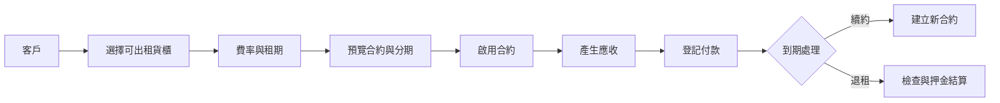

# 002 — 核心營運流程

## 目標

完成四條可實際營運的端到端流程：

1. 建立及啟用合約
2. 應收與收款
3. 續約
4. 退租與押金結算

## 操作者流程



## 1. 建立合約

建立合約必須由單一後端 Service 完成，不可由前端分多次 CRUD 拼裝。

執行順序：

1. 驗證客戶為啟用狀態。
2. 驗證費率方案。
3. 重新檢查所有貨櫃在指定租期內是否可用。
4. 建立合約主檔。
5. 建立一筆或多筆合約項目。
6. 產生押金及分期應收。
7. 更新貨櫃狀態。
8. 寫入 Audit。
9. 回傳合約、貨櫃及付款期程摘要。

## 2. 收款

支援：

- 銀行轉帳
- 現金
- 帳號後五碼
- 一筆應收多次付款
- 作廢錯誤付款
- 押金退款
- 溢繳警告

帳單狀態：

```text
UNPAID
PARTIAL
PAID
VOID
```

付款狀態：

```text
CONFIRMED
VOID
REFUNDED
```

已確認付款不得直接修改金額；錯誤須作廢後重建。

## 3. 續約

1. 不得修改舊合約日期。
2. 建立新合約並使用 `previous_contract_id`。
3. 新費率只影響新合約。
4. 原貨櫃保持出租狀態。
5. 產生新一期應收。
6. 未清帳款存在時顯示警告，但是否阻擋由設定決定。
7. Audit 記錄續約來源及新合約。

## 4. 退租

退租 Wizard：

```text
Step 1 退租日期與原因
Step 2 未結帳款
Step 3 貨櫃檢查
Step 4 遙控器歸還
Step 5 損壞、清潔與其他費用
Step 6 押金抵扣及退款
Step 7 最終確認
```

狀態流程：

```text
ACTIVE → ENDING → ENDED
RENTED → INSPECTION → AVAILABLE／MAINTENANCE
```

## 前端頁面

```text
CustomersPage
ContainersPage
RatePlansPage
ContractsPage
ContractDetailPage
InvoicesPage
PaymentsPage
RenewalsPage
TerminationPage
```

建立合約 Wizard：

```text
Step 1 客戶
Step 2 一個或多個貨櫃
Step 3 費率與租期
Step 4 押金與分期
Step 5 預覽
Step 6 完成
```

## API 建議

```text
createContractDraft
activateContract
listContracts
getContractDetail
recordPayment
voidPayment
renewContract
startTermination
completeTermination
completeContainerInspection
```

所有寫入 API 必須接受 `requestId`。

## 真實案例

### 案例 A：單櫃

- 20 呎裸櫃
- 年租 48,000
- 分兩期
- 押金 5,000

### 案例 B：多櫃

- 5 號及 6 號 10 呎櫃
- 同一份合約
- 合併價格
- 各櫃仍保留獨立資產紀錄

### 案例 C：部分付款

- 應收 24,000
- 第一次付款 10,000
- 第二次付款 14,000
- 狀態依序為 PARTIAL、PAID

### 案例 D：退租扣款

- 押金 10,000
- 遙控器遺失 350
- 清潔費 1,000
- 退款 8,650

## 驗收條件

- [ ] 單櫃及多櫃合約可啟用。
- [ ] 合約啟用自動產生押金與分期應收。
- [ ] 一筆應收可分次付清。
- [ ] 作廢付款後餘額正確恢復。
- [ ] 續約保留舊合約。
- [ ] 退租可處理扣款與退款。
- [ ] 貨櫃退租後先進入檢查。
- [ ] Dashboard 可讀取新版資料。
- [ ] ManualTests 與前端測試通過。

## Antigravity IDE 執行指令

```text
依本計畫完成四條核心流程。
每完成一條流程先補測試，再進入下一條。
禁止用前端多次 CRUD 取代後端單一業務交易。
完成後停止並提供四個真實案例的測試結果。
```
